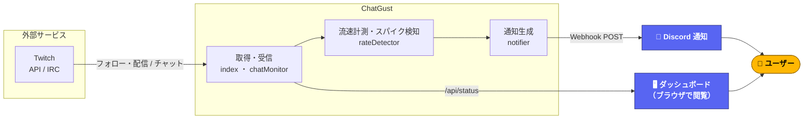

<div align="center">


# ChatGust

**Twitch のフォロー中配信を裏で監視し、チャットが“爆発的に盛り上がった瞬間”だけ Discord に通知する常駐ボット**

[](https://github.com/endomasayaendo/chatgust/actions/workflows/ci.yml)


</div>

---

「お気に入りの配信、気づいたら神回が終わってた…」をなくすためのツール。
フォロー中のライブ配信のチャット流速を常時計測し、**普段より統計的に突出して伸びた瞬間**だけを検知して Discord に飛ばします。

<!-- スクリーンショットを追加する場合: docs/dashboard.png を置いて下の行を有効化
<p align="center"></p>
-->

> [!NOTE]
> 現状は **self-host 前提の開発者向けツール**です（各自が Twitch アプリ・Discord Webhook を用意し、自分の環境にデプロイして使う）。非エンジニアでも使えるホスト型サービス化は[今後の目標](#-今後の目標)を参照。

---

## ✨ 機能

- 📡 フォロー中のライブ配信を **1分ごと**に自動取得・監視
- 🔌 IRC WebSocket **1本**で全チャンネルのチャットを同時受信
- 📈 **zスコア検知** — 平常時のばらつきから統計的に突出した瞬間を捕捉（配信規模に依存しない）
- 🎯 通知対象チャンネルを **許可リスト**で絞り込み可能（`NOTIFY_CHANNELS`）
- 🖥 **ダッシュボード**(ブラウザ)で監視中チャンネルの流速・ベースライン・アラート履歴をリアルタイム確認
- 🔁 トークンの自動リフレッシュ／IRC 自動再接続で落ちにくい

---

## 🏗 アーキテクチャ



---

## 🚀 セットアップ

### 1. 事前準備

<details>
<summary><b>Twitch アプリの作成</b></summary>

1. [Twitch Developer Console](https://dev.twitch.tv/console/apps) でアプリを新規作成
2. OAuth リダイレクト URL に `http://localhost:22377/callback` を追加
3. **Client ID** と **Client Secret** を控えておく
</details>

<details>
<summary><b>Discord Webhook の作成</b></summary>

1. 通知を送りたいチャンネルの **設定（歯車アイコン）** を開く
2. **連携サービス → ウェブフック → 新しいウェブフック** で作成
3. 作成したウェブフックの **URL をコピー** して控えておく

> 詳しい手順は [Discord 公式マニュアル「ウェブフックのご紹介」](https://support.discord.com/hc/ja/articles/228383668-%E3%82%A6%E3%82%A7%E3%83%96%E3%83%95%E3%83%83%E3%82%AF%E3%81%AE%E3%81%94%E7%B4%B9%E4%BB%8B) を参照。

</details>

### 2. インストール

```bash
git clone https://github.com/endomasayaendo/chatgust.git
cd chatgust
npm install
cp .env.example .env
```

`.env` を開いて以下を記入：

```dotenv
TWITCH_CLIENT_ID=<Client ID>
TWITCH_CLIENT_SECRET=<Client Secret>
DISCORD_WEBHOOK_URL=https://discord.com/api/webhooks/...
```

### 3. Twitch 認証（初回のみ）

```bash
npm run auth
```

ブラウザが開くので Twitch にログイン。認証が完了するとアクセストークンが `.env` に自動保存される。

### 4. 起動

```bash
npm start
```

`http://localhost:3000` でダッシュボードを確認できる。
あとは起動したまま放置すれば、フォロー中の配信のチャットが盛り上がった瞬間に **Discord へ通知が届く**。

---

## ☁️ Fly.io へのデプロイ（常時稼働）

PC の電源に依存せず常時監視したい場合は Fly.io にデプロイする。
**`<your-app-name>` は自分で決めた一意なアプリ名**に置き換えること（Fly のアプリ名は世界で一意）。

```bash
# flyctl のインストール（未インストールの場合）
# https://fly.io/docs/hands-on/install-flyctl/

flyctl auth login
flyctl apps create <your-app-name>          # 名前は世界で一意（既存名は使用不可）
# ↑ 作成した名前を fly.toml の `app = "..."` に書き換える
flyctl secrets import < .env                # TWITCH_*, DISCORD_WEBHOOK_URL など自分の認証情報
flyctl deploy
flyctl scale count 1 -a <your-app-name>     # 必ず1台に固定（重要・下記Note参照）
```

デプロイ後は `https://<your-app-name>.fly.dev` でダッシュボードにアクセスできる。

> [!IMPORTANT]
> **必ず1インスタンスで動かすこと。**
> 本アプリは「1プロセスが全配信を監視する」シングルトン構成。`fly launch` はデフォルトでマシンを2台作ることがあり、その場合**両方が独立して検知・通知するため Discord 通知が二重に届く**。
> `flyctl scale count 1 -a <your-app-name>` で必ず1台に固定する。台数は `flyctl machines list -a <your-app-name>` で確認（`started` が1台ならOK）。

> [!NOTE]
> Fly.io の無料枠で動作する。`fly.toml` の `primary_region = "nrt"` は東京リージョン。変更する場合は `flyctl platform regions` で一覧を確認する。

### GitHub Actions による自動デプロイ（任意）

`main` への push で、テスト通過後に自動デプロイできる（`ci.yml` → `cd.yml`）。使う場合は、フォーク先リポジトリの **Settings → Secrets and variables → Actions** に**自分の** Fly トークンを登録する：

| Secret          | 値                                                                  |
| --------------- | ------------------------------------------------------------------- |
| `FLY_API_TOKEN` | `flyctl tokens create deploy -a <your-app-name>` で発行したトークン |

> [!TIP]
> GitHub Actions を使わず、手元から `flyctl deploy` するだけでも運用できる。その場合 `FLY_API_TOKEN` の登録は不要（`flyctl auth login` 済みの端末から実行するだけ）。

---

## 🎚 アラート検知ロジック

```text
直近30秒のメッセージ数              = current_rate
直前10ウィンドウ（約5分間）の平均     = baseline
直前10ウィンドウの標準偏差（ばらつき） = stddev

スパイク判定（current_rate >= MIN_RATE が前提。起動後2分間はウォームアップとして判定しない）:

  ① zスコア検知（規模非依存・メイン）:
     current_rate >= baseline + SPIKE_Z × stddev   （デフォルト: 3.0σ）

  ② 乗算フォールバック（ばらつきが極端に小さいチャット向け）:
     current_rate >= baseline × SPIKE_THRESHOLD     （デフォルト: 8倍）

  ① または ② のどちらかを満たすと「スパイク」と判定。

baseline < 1 の場合（配信開始直後など）:
  current_rate >= MIN_RATE × 2 をスパイク判定の閾値として使用

アラート発火:
  スパイク判定が2回連続したチャンネルで、かつクールダウン経過後に Discord へ通知。
  （単発のスパイクは瞬間的な揺れとみなして見送る）
```

> [!TIP]
> **なぜ zスコアか** — 「ベースラインの何倍」という乗算ルールだけだと、同接が多くチャットが速い配信ほど相対的な揺れが小さくなり、8倍はほぼ達成不可能で通知が出ませんでした。平常時の「平均＋ばらつき(σ)」を基準にすることで、小規模配信から大手まで同じ感覚で検知できます。通知が多すぎる/少なすぎる場合は `SPIKE_Z` を上下させて調整してください（**大きいほど鈍感**）。

### ⚙️ 設定（環境変数）

すべて任意。`.env`（ローカル）または `flyctl secrets set`（本番）で変更できる。

| 変数                 | デフォルト | 説明                                                                                                                 |
| -------------------- | :--------: | -------------------------------------------------------------------------------------------------------------------- |
| `SPIKE_Z`            |   `3.0`    | 平常の平均から何σ超えたらアラートを出すか（**小さいほど敏感**）                                                      |
| `SPIKE_THRESHOLD`    |    `8`     | 乗算フォールバックの倍率（ばらつきが極小のチャット向け）                                                             |
| `MIN_RATE`           |    `5`     | アラートに必要な最低メッセージ数（30秒）                                                                             |
| `COOLDOWN_MIN`       |    `5`     | 同チャンネルへの連続アラートを防ぐ間隔（分）                                                                         |
| `NOTIFY_CHANNELS`    | （未設定） | カンマ区切りのチャンネル login。設定するとそのチャンネルだけを監視・通知（未設定ならフォロー中の全ライブ配信が対象） |
| `DASHBOARD_PASSWORD` | （未設定） | 設定するとダッシュボードに Basic 認証がかかる（ユーザー名 `admin` / パスワードは設定値）                             |

本番（Fly.io）への反映は再デプロイ不要。例：

```bash
flyctl secrets set SPIKE_Z=3.5 NOTIFY_CHANNELS=shroud,k4sen -a <your-app-name>
```

---

## 🧪 開発

```bash
npm test          # Vitest でユニットテスト
npm run typecheck # tsc --noEmit で型チェック
```

`main` への push / PR で CI（テスト＋型チェック）が自動実行される。

---

## 🗂 ファイル構成

```text
chatgust/
├── src/
│   ├── index.ts          # composition root（依存の生成・配線・起動のみ）
│   ├── config.ts         # 環境変数のパース・バリデーション（型付き Config）
│   ├── auth.ts           # 初回 Twitch 認証スクリプト（ローカルのみ実行）
│   ├── tokenStore.ts     # トークンの保持・リフレッシュ・.env への永続化
│   ├── twitchApi.ts      # Twitch REST API（フォロー一覧・ライブ配信取得・トークンリフレッシュ）
│   ├── streamSync.ts     # フォロー→絞り込み→ライブ取得→監視へ反映（定期同期）
│   ├── chatMonitor.ts    # 検知コーディネーター（detector・policy・irc を束ねる）
│   ├── ircClient.ts      # IRC WebSocket 転送（1接続で全チャンネルを JOIN）
│   ├── rateDetector.ts   # 流速計算（スライディングウィンドウ + zスコア）
│   ├── spikePolicy.ts    # アラート発火ポリシー（2連続スパイクで確定）
│   ├── alertDispatcher.ts# クールダウン・履歴・通知の送出
│   ├── notifier.ts       # Discord Webhook 送信（Notifier 抽象 + DiscordNotifier）
│   ├── notifyFilter.ts   # 通知対象の絞り込み（許可リスト）
│   └── server.ts         # Express アプリ（ダッシュボード配信 + /api/status + Basic認証）
├── test/                 # Vitest テスト
├── public/
│   ├── index.html      # ダッシュボード UI
│   └── app.js          # 5秒ごとに /api/status をポーリング
├── .github/workflows/
│   ├── ci.yml          # テスト + 型チェック
│   └── cd.yml          # CI 成功後に Fly.io へ自動デプロイ
├── fly.toml            # Fly.io 設定
├── Dockerfile
└── .env.example
```

---

## 🎯 今後の目標

**いまの形:** 各自が自分の環境にデプロイして使う self-host ツール。動かすには Twitch アプリの作成や Fly.io へのデプロイなど、ある程度の技術的な準備が必要で、主に開発者向け。

**目指す姿:** 技術知識がなくても、ブラウザだけで使える **ホスト型サービス**。運営側がアプリを1つ運用し、ユーザーは次の操作だけで使えるようにしたい。

- **Twitch でログインするだけ** — 自分で Twitch アプリを作る必要なし
- **Discord の Webhook URL を貼るだけ** で通知先を設定 — 自分でサーバーにデプロイする必要なし
- 監視したい配信・通知のしきい値・通知リストを Web 画面から設定

実現には、ユーザーごとの設定を保存する仕組みやログイン基盤など、今の「1人用」構成からそれなりの作り替えが必要になる見込み。
