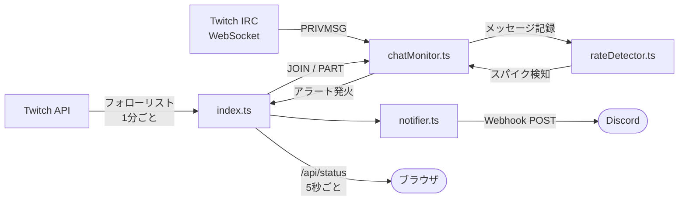

# ChatGust

Twitch のフォロー中配信を裏で監視し、チャットが急加速した瞬間だけ Discord に通知するツール。
Fly.io に常駐させることで PC の電源を切っても動き続ける。

---

## 機能

- フォロー中のライブ配信を1分ごとに自動取得・監視
- IRC WebSocket 1本で全チャンネルのチャットを受信
- 直近30秒の流速がベースラインの8倍以上になったら Discord に通知
- ブラウザダッシュボードでリアルタイムの流速・アラート履歴を確認

---

## アーキテクチャ



---

## 事前準備

### Twitch アプリの作成

1. [Twitch Developer Console](https://dev.twitch.tv/console/apps) でアプリを新規作成
2. OAuth リダイレクト URL に `http://localhost:22377/callback` を追加
3. **Client ID** と **Client Secret** を控えておく

### Discord Webhook の作成

通知を送りたいチャンネルの **設定 → 連携サービス → ウェブフック** から Webhook を作成し、URL を控えておく。

---

## セットアップ

```bash
git clone https://github.com/<your-username>/chatgust.git
cd chatgust
npm install
cp .env.example .env
```

`.env` を開いて以下を記入：

```
TWITCH_CLIENT_ID=<Client ID>
TWITCH_CLIENT_SECRET=<Client Secret>
DISCORD_WEBHOOK_URL=https://discord.com/api/webhooks/...
```

### Twitch 認証（初回のみ）

```bash
npm run auth
```

ブラウザが開くので Twitch にログインする。認証が完了するとアクセストークンが `.env` に自動保存される。

---

## ローカルで起動

```bash
npm start
```

`http://localhost:3000` でダッシュボードを確認できる。

---

## Fly.io へのデプロイ（常時稼働）

PC の電源に依存せず常時監視したい場合は Fly.io にデプロイする。

```bash
# flyctl のインストール（未インストールの場合）
# https://fly.io/docs/hands-on/install-flyctl/

flyctl auth login
flyctl apps create chatgust        # アプリ名は任意
flyctl secrets import < .env
flyctl deploy
```

デプロイ後は `https://<app-name>.fly.dev` でダッシュボードにアクセスできる。

> **Note**  
> Fly.io の無料枠で動作する。`fly.toml` の `primary_region = "nrt"` は東京リージョン。変更する場合は `flyctl platform regions` で一覧を確認する。

### GitHub Actions による自動デプロイ

`main` ブランチへのプッシュで自動デプロイされる設定が含まれている。
リポジトリの **Settings → Secrets and variables → Actions** に以下を登録する：

| Secret | 値 |
|--------|----|
| `FLY_API_TOKEN` | `flyctl tokens create deploy -a <app-name>` で発行したトークン |

---

## アラート検知ロジック

```
直近30秒のメッセージ数           = current_rate
直前10ウィンドウ（約5分間）の平均  = baseline

アラート条件:
  current_rate >= baseline × SPIKE_THRESHOLD   （デフォルト: 8倍以上）
  AND current_rate >= MIN_RATE                  （デフォルト: 5件以上）
  AND 前回アラートから COOLDOWN_MIN 分以上経過   （デフォルト: 5分）

baseline < 1 の場合（配信開始直後など）:
  current_rate >= MIN_RATE × 2 を閾値として使用
```

`.env` で以下の変数を変更することで調整できる：

| 変数 | デフォルト | 説明 |
|------|-----------|------|
| `SPIKE_THRESHOLD` | `8` | ベースラインの何倍でアラートを出すか |
| `MIN_RATE` | `5` | アラートに必要な最低メッセージ数（30秒） |
| `COOLDOWN_MIN` | `5` | 同チャンネルへの連続アラートを防ぐ間隔（分） |

---

## ファイル構成

```
chatgust/
├── src/
│   ├── index.ts        # Express サーバー + メインオーケストレーター
│   ├── auth.ts         # 初回 Twitch 認証スクリプト（ローカルのみ実行）
│   ├── twitchApi.ts    # Twitch REST API（フォロー一覧・ライブ配信取得・トークンリフレッシュ）
│   ├── chatMonitor.ts  # IRC WebSocket 管理（1接続で全チャンネルを JOIN）
│   ├── rateDetector.ts # 流速計算（スライディングウィンドウ）
│   └── notifier.ts     # Discord Webhook 送信
├── public/
│   ├── index.html      # ダッシュボード UI
│   └── app.js          # 5秒ごとに /api/status をポーリング
├── .github/workflows/
│   └── deploy.yml      # GitHub Actions 自動デプロイ
├── fly.toml            # Fly.io 設定
├── Dockerfile
└── .env.example
```
