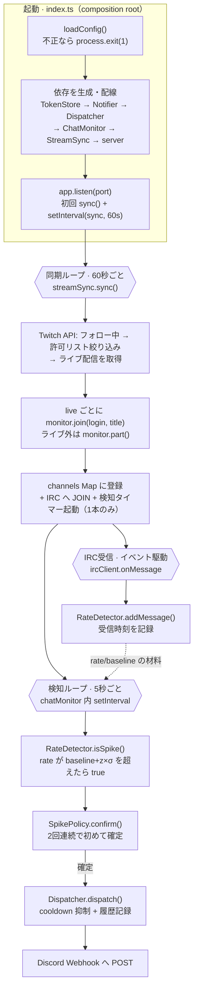
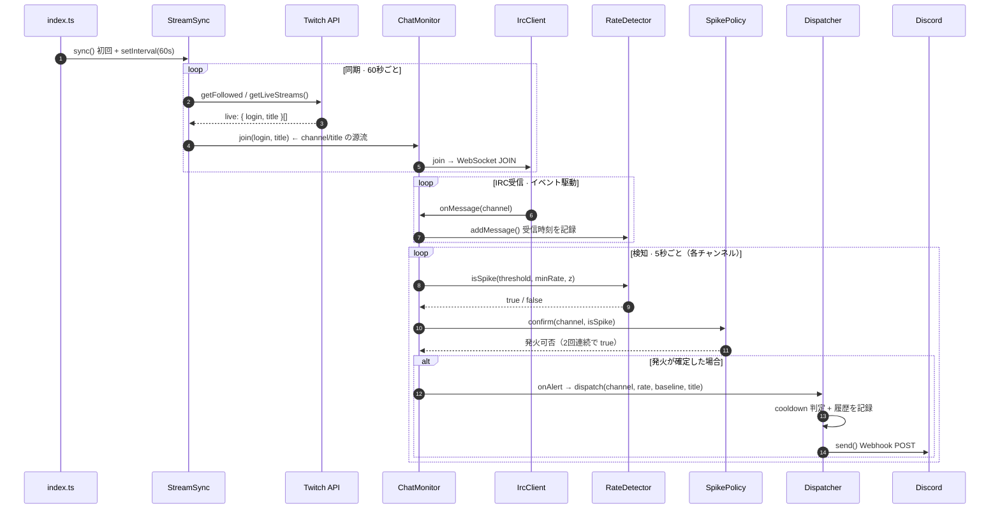

# アーキテクチャ / 処理フロー

chatgust は、Twitch のフォロー中ライブ配信を監視し、チャットが「普段より」盛り上がった瞬間を検知して Discord に通知するアプリ。動いているのは **3 つの独立したループ**で、それぞれ別の間隔で回り続ける。

| ループ | 間隔 | 仕事 |
| --- | --- | --- |
| 同期ループ | 60 秒ごと | 今ライブ中の配信を取得し、監視対象を join / part する |
| IRC 受信 | イベント駆動 | チャットが届くたびに受信時刻を記録する |
| 検知ループ | 5 秒ごと | 各チャンネルの盛り上がりを判定し、確定したら通知へ |

## 全体像

## シーケンス図

## 各メッセージのソース位置

| # | 処理 | 位置 |
| --- | --- | --- |
| 1 | listen 成功後に初回 sync、以降 60 秒間隔で登録 | `index.ts:59-60` |
| 2 | フォロー中 → 許可リスト絞り込み → ライブ取得 | `streamSync.ts:52-54` |
| 3 | 戻り値 `Stream[]`（login・title を含む） | `streamSync.ts:54` |
| 4 | `monitor.join(stream.login, stream.title)` | `streamSync.ts:59` |
| 5 | IRC へ JOIN | `chatMonitor.ts:64` → `ircClient.ts:58` |
| 6 | PRIVMSG をパースし `onMessage(channel)` | `ircClient.ts:38` |
| 7 | `addMessage()` で受信時刻を記録 | `chatMonitor.ts:37-38` → `rateDetector.ts:21` |
| 8 | 5 秒ごとの `isSpike()` | `chatMonitor.ts:49` → `rateDetector.ts:66` |
| 9 | z スコア／乗算フォールバックで真偽を返す | `rateDetector.ts:80` |
| 10 | `confirm()` | `chatMonitor.ts:50` → `spikePolicy.ts:19` |
| 11 | `isSpike && prev`（2 回連続で true） | `spikePolicy.ts:22` |
| 12 | コールバック経由で dispatch | `chatMonitor.ts:51` → `index.ts:41` → `alertDispatcher.ts:27` |
| 13 | cooldown 通過時のみ履歴記録 | `alertDispatcher.ts:28-37` |
| 14 | Discord embed を送信 | `alertDispatcher.ts:39` → `notifier.ts:26` |

## 設計メモ

- **fail-fast の集約** — 設定不正で終了するのは `loadConfig()` の 1 か所だけ。以降の部品は「設定は正しい」前提で書ける。
- **依存性逆転** — `ChatMonitor` は `Dispatcher` を直接知らず、`onAlert` コールバック経由で疎結合（`index.ts:41`）。
- **タイマーは常に 1 本** — `chatMonitor.ts:45` の `if (this.timer) return` が二重起動を防ぐ。
- **配信規模に依存しない検知** — 「平均 + ばらつき(σ)」の z スコアで判定し、小規模〜大手まで同じ基準で効く（`rateDetector.ts:66-84`）。
- **自己修復** — トークン失効(401)を検知したら `TokenStore.refresh()` し、次サイクルで userId を取り直す（`streamSync.ts:66-74`）。
