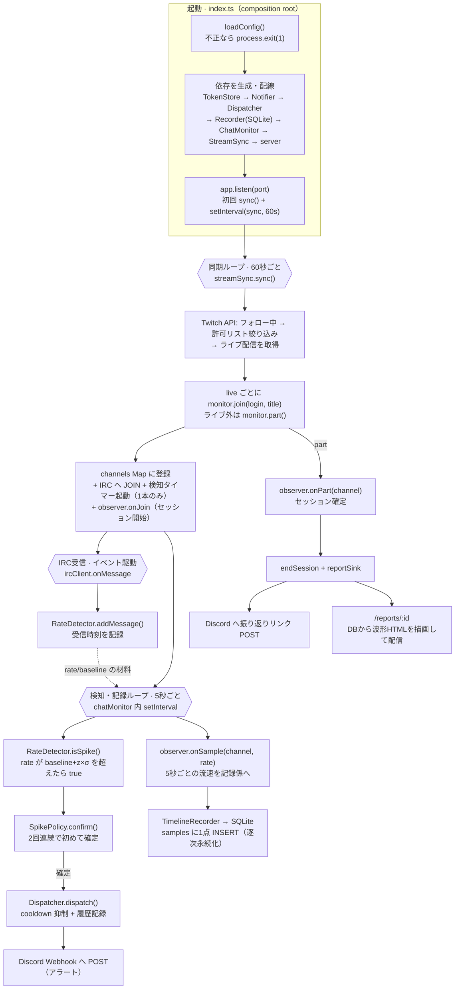
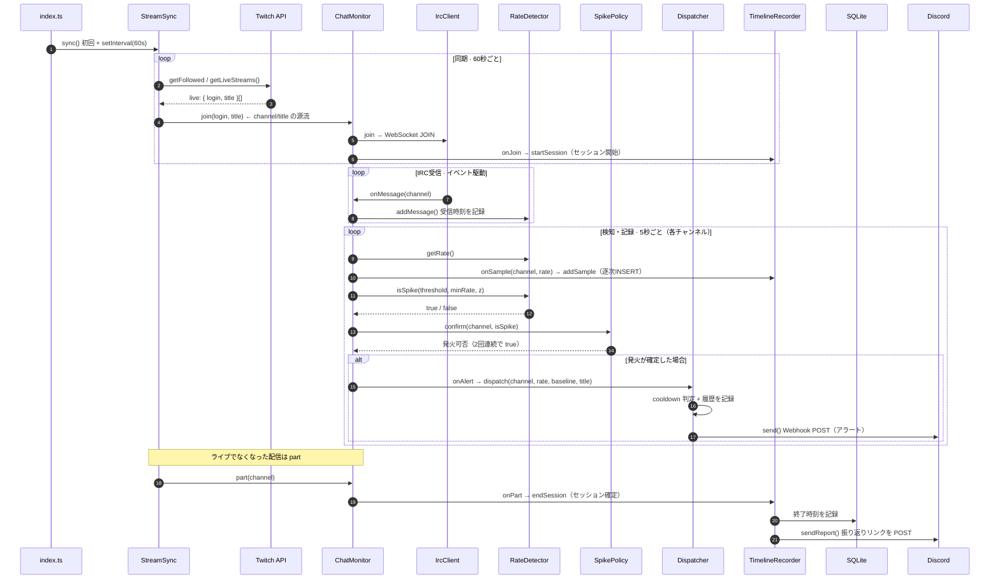

# アーキテクチャ / 処理フロー

chatgust は、Twitch のフォロー中ライブ配信を監視し、チャットが「普段より」盛り上がった瞬間を検知して Discord に通知するアプリ。さらに、配信ごとにチャット流速を記録し、**配信終了時に「盛り上がり波形」レポートを生成して Discord にリンク通知する**（事後の振り返り）。動いているのは **3 つの独立したループ**で、それぞれ別の間隔で回り続ける。

| ループ | 間隔 | 仕事 |
| --- | --- | --- |
| 同期ループ | 60 秒ごと | 今ライブ中の配信を取得し、監視対象を join / part する |
| IRC 受信 | イベント駆動 | チャットが届くたびに受信時刻を記録する |
| 検知・記録ループ | 5 秒ごと | 各チャンネルの流速を計測し、（a）盛り上がりを判定して通知へ、（b）流速を配信ごとに SQLite へ記録する |

通知（リアルタイム）と振り返り（事後）は、共通の流速計測（`RateDetector`）の上に並ぶ **別系統**。`ChatMonitor` は極小の `SessionObserver` インターフェース越しに記録係へ「開始・流速・終了」を渡すだけで、保存方式や通知手段は知らない。配信終了（`part`）で記録係がセッションを確定し、レポートリンクを Discord に送る。

## 全体像

## シーケンス図

## 各メッセージのソース位置

番号は上のシーケンス図の autonumber（1〜21）にそのまま対応する。
位置は行番号ではなく**シンボル（クラス.メソッド / 関数名）**で示す（コード編集でズレないため。該当箇所はエディタの検索で辿る）。

| # | 処理 | 位置 |
| --- | --- | --- |
| 1 | listen 成功後に初回 sync、以降 60 秒間隔で登録 | `index.ts` app.listen コールバック → `StreamSync.sync()` + `setInterval` |
| 2 | フォロー中 → 許可リスト絞り込み → ライブ取得 | `StreamSync.sync()`（`getFollowedChannels` → `filterChannels` → `getLiveStreams`） |
| 3 | 戻り値 `Stream[]`（login・title を含む） | `TwitchApi.getLiveStreams()` |
| 4 | `monitor.join(stream.login, stream.title)` | `StreamSync.sync()` → `ChatMonitor.join()` |
| 5 | IRC へ JOIN | `ChatMonitor.join()` → `IrcClient.join()` |
| 6 | `onJoin` でセッション開始 | `ChatMonitor.join()` → `TimelineRecorder.onJoin()` → `repo.startSession()` |
| 7 | PRIVMSG をパースし `onMessage(channel)` | `IrcClient`（PRIVMSG パース → `onMessage`） |
| 8 | `addMessage()` で受信時刻を記録 | `IrcClient.onMessage` → `RateDetector.addMessage()` |
| 9 | 直近30秒の流速 `getRate()` | `ChatMonitor` tick → `RateDetector.getRate()` |
| 10 | `onSample` で流速を1点記録（逐次 INSERT） | `ChatMonitor` tick → `TimelineRecorder.onSample()` → `repo.addSample()` |
| 11 | `isSpike()` | `ChatMonitor` tick → `RateDetector.isSpike()` |
| 12 | z スコア／乗算フォールバックで真偽を返す | `RateDetector.isSpike()` |
| 13 | `confirm()` | `ChatMonitor` tick → `SpikePolicy.confirm()` |
| 14 | `isSpike && prev`（2 回連続で true） | `ConsecutiveSpikePolicy.confirm()` |
| 15 | コールバック経由で dispatch | `ChatMonitor` tick → `onAlert`（index.ts で配線）→ `AlertDispatcher.dispatch()` |
| 16 | cooldown 通過時のみ履歴記録 | `AlertDispatcher.dispatch()` |
| 17 | Discord embed を送信（アラート） | `AlertDispatcher.dispatch()` → `DiscordNotifier.send()` → `sendDiscordAlert()` |
| 18 | ライブでなくなった配信を part | `StreamSync.sync()` → `ChatMonitor.part()` |
| 19 | `onPart` でセッション確定 | `ChatMonitor.part()` → `TimelineRecorder.onPart()` |
| 20 | 終了時刻を DB に記録 | `TimelineRecorder.onPart()` → `SqliteTimelineRepository.endSession()` |
| 21 | Discord へ振り返りリンクを送信 | `TimelineRecorder.onPart()` → `reportSink`（index.ts で配線）→ `DiscordNotifier.sendReport()` → `sendDiscordReport()` |

### シーケンス図の常時ループ外（起動時・改名・閲覧リクエスト時）
- 起動時に、前回異常終了で残った未終了セッションを確定 … `index.ts`（起動時）→ `SqliteTimelineRepository.closeDangling()`
- 配信中の改名（同期で同じチャンネルを再 join したとき）… `ChatMonitor.join()`（既存分岐・title 変化時のみ `onTitleChange`）→ `TimelineRecorder.onTitleChange()` → `repo.updateTitle()`
- `/reports/:id` … DB から波形HTMLを描画して配信（Discordリンク／ブラウザの着地点） … `server.ts` の `GET /reports/:id` → `repo.getSession()` → `renderHtml()`
- `/api/reports`（一覧）/ `/api/reports/:id`（JSON） … `server.ts` の `GET /api/reports` / `GET /api/reports/:id`

## 設計メモ

- **fail-fast の集約** — 設定不正で終了するのは `loadConfig()` の 1 か所だけ。以降の部品は「設定は正しい」前提で書ける。
- **依存性逆転** — `ChatMonitor` は `Dispatcher` を直接知らず `onAlert` コールバック経由で疎結合。振り返りも同様に、`ChatMonitor` は極小の `SessionObserver`（`onJoin/onSample/onTitleChange/onPart`）だけに依存し、記録先・保存方式・Discord 通知は `TimelineRecorder` 側で完結する。通知系と振り返り系が混ざらない。
- **記録の例外は隔離する** — 観察者呼び出しは `chatMonitor` の `notifyObserver()` が try/catch で包み、記録側（DB書き込み等）で例外が出ても検知・通知を巻き添えにしない。加えて `index.ts` に `uncaughtException`/`unhandledRejection` の最後の砦を置き、一過性の例外で常駐ボットが落ちないようにする。
- **タイマーは常に 1 本** — `chatMonitor` の `if (this.timer) return` が二重起動を防ぐ。
- **配信規模に依存しない検知** — 「平均 + ばらつき(σ)」の z スコアで判定し、小規模〜大手まで同じ基準で効く（`RateDetector.isSpike()`）。
- **逐次永続化でクラッシュ耐性** — 流速は 5 秒ごとに即 SQLite へ INSERT（WAL）。プロセスが落ちても直近数秒しか失われず、起動時 `closeDangling` が未終了セッションを確定する。
- **URL の秘匿** — レポート id はランダムな 12 桁 hex（連番の列挙による覗き見を防ぐ）。
- **自己修復** — トークン失効(401)を検知したら `TokenStore.refresh()` し、次サイクルで userId を取り直す（`StreamSync.sync()` の 401 catch）。
